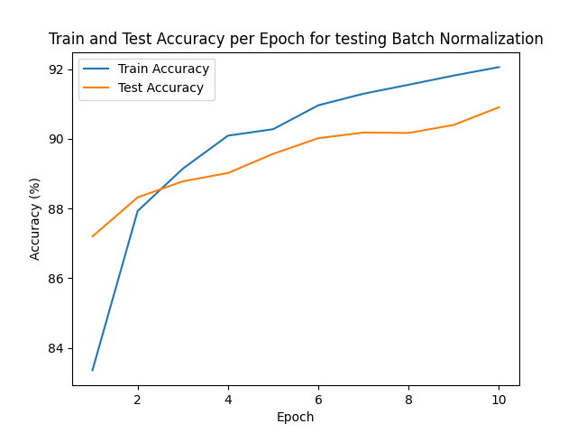
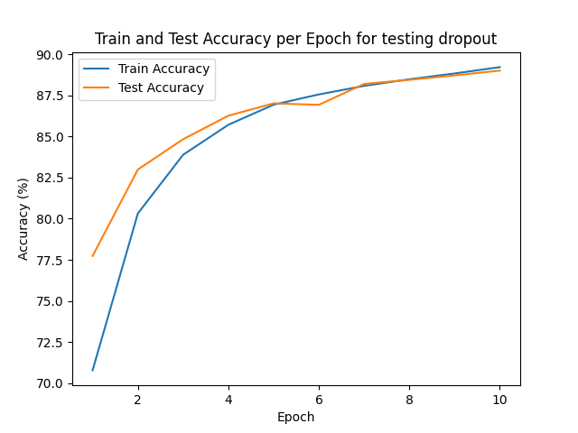
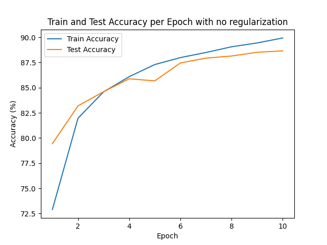
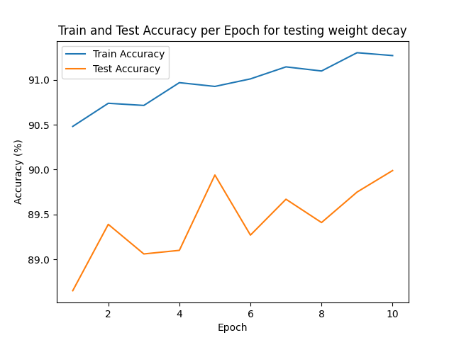

# Report: LeNet-5 on FashionMNIST  
CS 5787 — Deep Learning (2025FA)  
Student: 
    Aishwarya Birla(ab3347)
    Vanshika Bajaj(vb364)

## Introduction

We implemented and evaluated the LeNet-5 convolutional neural network architecture originally proposed by LeCun et al. (1998) but adapted for the FashionMNIST dataset, which consists of 28x28 grayscale images from 10 clothing categories.

## How to use the saved models 

In order to load and check the saved weights, you can execute the file [here](testing_saved_models.ipynb) and execute the cells for which you want to test the model. 

## Model Architecture

The architecture closely follows LeNet-5’s structure, modified for the 28x28 input size rather than the original 32x32. The layers include:

- **Conv1 (C1):** 6 kernels of size 5x5, stride 1, producing 24x24x6 output.
- **Pool1 (S2):** Average pooling 2x2, stride 2 → 12x12x6 output.
- **Conv2 (C3):** 16 kernels of size 5x5, stride 1 → 8x8x16 output.
- **Pool2 (S4):** Average pooling 2x2, stride 2 → 4x4x16 output.
- **Conv3 (C5):** Fully connected convolution producing 120 features.
- **FC1 (F6):** Fully connected dense layer with 84 units.
- **Output:** Fully connected layer with 10 classes.

We replaced the original tanh activations with ReLU to speed up training and reduce saturation effects.
Hyperparameters like batch normalization, weight decay and dropout layers were added for some experiments.

| Layer            | Feature Map | Size     | Kernel Size | Stride | Activation |
|------------------|-------------|----------|-------------|--------|------------|
| Input            | Image       | 1x28x28  | -           | -      | -          |
| 1. Convolution   | 6           | 24x24    | 5x5         | 1      | ReLU       |
| 2. Avg Pooling   | 6           | 12x12    | 2x2         | 2      | -          |
| 3. Convolution   | 16          | 8x8      | 5x5         | 1      | ReLU       |
| 4. Avg Pooling   | 16          | 4x4      | 2x2         | 2      | -          |
| 5. Convolution   | 120         | 1x1      | 4x4         | 1      | ReLU       |
| 6. FC            | -           | 84       | -           | -      | ReLU       |
| Output (FC)      | -           | 10       | -           | -      | Softmax    |

## Training Procedure

- **Data split:** The original 60,000 training samples were split into 50,000 for training and 10,000 for model tuning and validation.
- **Batch size:** 64, chosen to balance computation time and gradient stability.
- **Optimizer:** Adam optimizer with learning rate 0.001 was used after testing like 0.003 and 0.005 several settings for stable and fast convergence.
- **Epochs:** The network was trained for up to 10 epochs, after experimenting for 30 epochs and observing overfitting after 10.
- **Dropout:** The dropout value is 0.3, after using 0.2 nad 0.5 because it was the sweet spot, otherwise the model was hampering feature detection and reducing the accuracy below the one of the model without regularization 
- **Loss function:** Cross-entropy loss was used as its most appropriate for multi-class classification.
- **Weight Decay:** The L2 regularization value I choose was 0.007 because 0.005 and 0.006 was giving lower testing accuracy and 0.008 was overfitting. 

## Evaluation and Results

- The LeNet5 models trained on FashionMNIST with various regularization techniques achieved good performance, surpassing the 88% test accuracy threshold expected.
- No Regularization (Baseline): Achieved 88.65% accuracy, serving as the reference performance.
- Dropout: Provided a further small improvement with 89.00% accuracy. Dropout reduces co-adaptation of neurons, improving generalization. It reduced training accuracy slightly (expected) but improved generalization on validation and test sets.
- Weight Decay: Improved the test accuracy to 89.99%. This L2 regularization helps reduce overfitting by penalizing large weights. 
- Batch Normalization: Gave the best improvement, reaching 90.91% test accuracy. Batch normalization stabilizes learning by normalizing activations within mini-batches, allowing higher learning rates and faster convergence.

Overall, batch normalization proved the most effective regularization technique for this task, followed by weight decay and dropout, all showing improvements over the baseline. 

#### Accuracy plot for Batch Normalization:

#### Accuracy plot for Dropout:

#### Accuracy plot for No Regularization:

#### Accuracy plot for Weight Decay:

| Regularization        | Test Accuracy (%) |
|---------------------|-------------------|
| No Regularization    | 88.65             |
| Weight Decay (L2)    | 89.99             |
| Dropout              | 89.00             |
| Batch Normalization  | 90.91             |

  
## Conclusions

- Clear graphs combining training and test accuracies for each of the four experimental settings (baseline, dropout, batch normalization, combined) were plotted for visual analysis.
- Batch normalization notably accelerated convergence and helped reduce overfitting, therefore it was the best model among the others.
- The project reinforced understanding of CNN layers, training loops, and evaluation metrics in a practical deep learning task.
